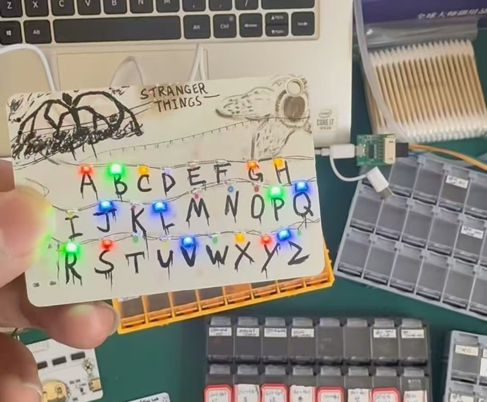
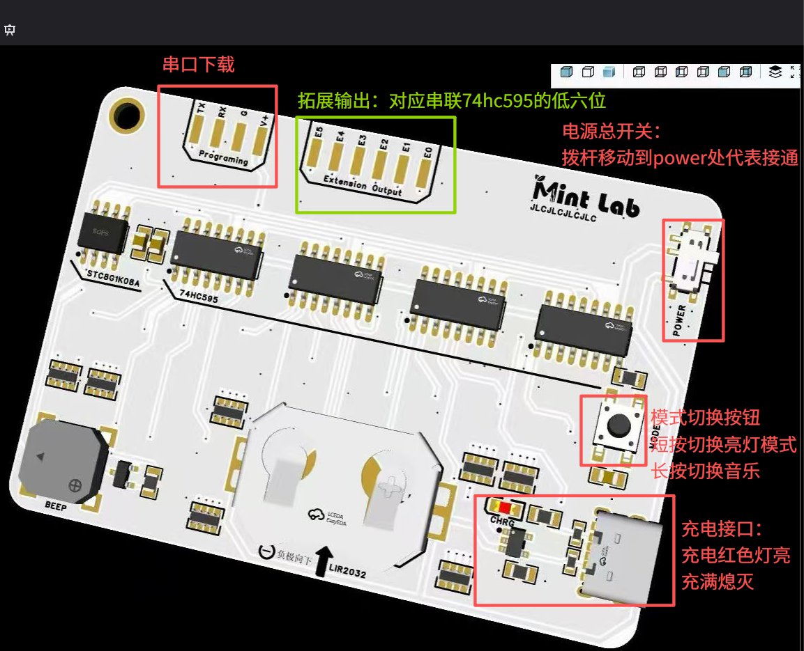

# 怪奇物语灯板



## 功能

### 短按切换亮灯模式

| 序号 | 模式                     |
| ---- | ------------------------ |
| 0    | 全灭                     |
| 1    | 全亮                     |
| 2    | 依次点亮再全部熄灭，重复 |
| 3    | 随机点亮                 |
| 4    | 依次显示R U N            |

### 长按切换三首音乐

**音乐1-> 音乐2->音乐3->关闭音乐**


## 编译下载方法



基于stc8g1k08a用sdcc在linux环境编译，下载使用stcgal，可参照`makefile`进行编译下载，编译调试脚本在`build.sh` ，可使用以下命令

```bash
source build.sh

可用命令:
  make           - 构建整个项目
  make clean     - 清理所有生成文件
  make flash     - 下载到单片机
  make info      - 显示项目信息
  make compile   - 只编译不链接
  make help      - 显示此帮助信息
```

